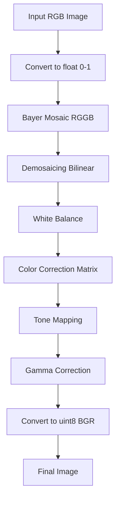

# isp-pipeline
This project implements a simplified Image Signal Processing (ISP) pipeline
that converts RAW Bayer images into RGB images.

Pipeline includes:

- Black level correction
- White balance
- Demosaicing
- Color correction
- Gamma correction
- Tone mapping

## Quickstart

Install dependencies

```bash
pip install -r requirements.txt
```
To run the demo:
```bash
python main.py --in data/input.png --out results/final.png --save-stages
```
## ISP Pipeline

