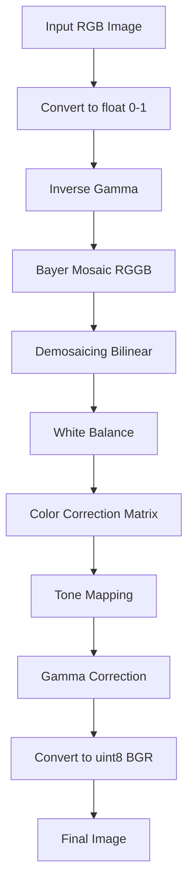

# isp-pipeline

This project implements a simplified Image Signal Processing (ISP) pipeline in Python.
It simulates a Bayer RGGB sensor from an RGB image and reconstructs the final RGB output through demosaicing, white balance, color correction, tone mapping, and gamma correction.

## Pipeline Includes

- Inverse Gamma (Linearization)
- Bayer mosaic simulation (RGGB)
- Demosaicing
- White balance
- Color correction matrix
- Tone mapping
- Gamma correction


## ISP Pipeline



## Results
### Input


### Bayer Mosaic


### Demosaiced Image


### Final Output


## Project Structure

isp-pipeline/  
├── data/  
├── isp/  
│         ├── color.py  
│         ├── demosaic.py  
│         ├── io.py  
│         ├── mosaic.py  
│         └── pipeline.py  
├── results/  
├── main.py  
├── requirements.txt  
└── README.md  


## Quickstart

Install dependencies:

```bash
pip install -r requirements.txt
```

Place an input image at `data/input.png`, then run:

```bash
python main.py --in data/input.png --out results/final.png --save-stages --wb-mode gray_world
```